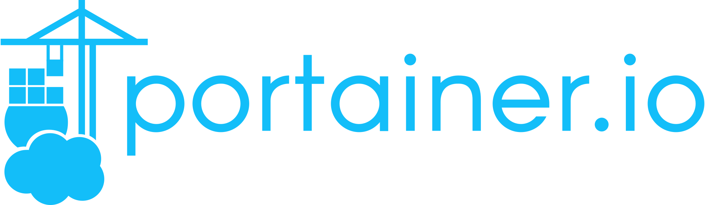
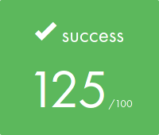

[](README.md) 

# `Inception`
Даный проект направлен на расширение знаний о системном администрировании с помощью Docker.
Вирутуализации нескольких Docker образов на хосте.

### Основная часть
Необходимо создать небольшую инфраструктуру, состоящую из различных сервисов.


#### Правила:
- Проект должен быть выполнен на виртуальной машине;
- Все файлы необходимые для конфигурации проекта, должны быть помещены в папку `srcs`;
- `Makefile` должен быть расположен в корне проекта. Он должен собрать все Docker образы и поднять контейнеры используя `docker-compose.yml`;
- Каждый Docker образ должен иметь то же имя, что и соответствующий сервис;
- Каждый сервис должен запускаться в отдельном контейнере;
- Контейнеры должны быть собраны либо из предпоследней стабильной версии `Alpine Linux`, либо из `Debian Buster`;
- Для каждого сервиса должен быть собственный `Dockerfile`.
Все `Dockerfile` должня быть вызваны `docker-compose.yml` через `Makefile`;
- Во всех `Dockerfile` запрещено прописывать пароли;
- В проекте запрещается использовать готовые Docker образы и сервысы вроде `DockerHub`.
Исключение `Alpine`/`Debian`;
- Запрещено использовать `network:` `host` or `--link` or `links:`;
- Запрещено запускать контейнеры с помощью команд и скриптов, выполняющих бесконечные циклы
(примеры `tail -f`, `bash`, `sleep infinity`, `while true`);
- Единственной точкой входа должен выступать контейнер NGINX по порту `443`, используя протокол TLSv1.2 или TLSv1.3.

#### Задачи:
- Создать Docker-контейнер, содержащий `NGINX` с TLSv1.2 или TLSv1.3;
- Создать Docker-контейнер, содержащий `WordPress` + php-fpm (все должно быть установлено и настроено);
- Создать Docker-контейнер, содержащий `MariaDB`;
- Хранилище (`volume`) для файлов сайта на WordPress;
- Хранилище (`volume`) для базы данных WordPress;
- Docker-сеть, которая устанавливает связь между контейнерами;
- Docker-контейнеры должны перезапускаться в случае сбоев.
- В базе данных должно быть два пользователя, один из которых - администратор.
Но администратор не должен иметь логин и пароль вроде: `admin`, `administrator`, `Administrator`, `admin-123` и т.д.;
- Хранилища (`volume`) должны быть расположены на хосте по пути `/home/<login>/data`, где `<login>` ник из Intra;
- Настроить свое доменное имя так, чтобы оно указывало на ваш локальный IP-адрес.
Доменное имя должно быть `<login>.42.fr`.
- Использовать переменное окружение. Рекомендуется использовать файл `.env` и хранить его в корне папки `srcs`.

### Бонусная часть
__Если оснваная часть работает безупречно, то можно приступать к бонусной части.__
Не стоит забывать, что:
1) Каждый сервис должен запускаться в отдельном контейнере;
2) Для каждого сервиса должен быть собственный `Dockerfile`.




#### Задачи:
- Настроить `Redis` кэш для сайта `Wordpress`, для управления кэшем;
- Настроить `FTP-server` указывающий на хранилище с сайтом `Wordpress`;
- Создайте простой статический сайт, на любом языке кроме PHP;
- Поднять контейнер с `Adminer`;
- Поднять контейнер с любым сервисом на свой выбор, который считаете полезным.

\* Если сервису понадобится дополнительное хранилище, просто создайте его. Также можно открыть больше портов, если это необходимо.

#### Заметки:
<details>
<summary><b>Сервис на свой выбор</b></summary>
Начиная делать данный проект, у меня не было четкого плана на дополнительный сервис.

Так уж сложилось, что увидел первым `Portainer` и он запал в душу.
Объяснять зачем и почему не буду, тут надо просто поднять контейнер с ним)
Более подробная информации: [Официальный сайт](https://www.portainer.io/) | [Документация](https://docs.portainer.io/)
И есть одна неприятная пасхалка, которая фиксится, но мне было лень.
Поэтому сразу предупреждаю, что для первого входа в Portainer, есть timeout error.
</details>


<details>
<summary><b>Вход в поднятый контейнер</b></summary>
Когда контейнер поднят и хочется посмотреть, что там внутри.

```bash
docker exec -it <container> <shell>
```
`<container>` - заменяется на <container_id> или \<name>  (`docker ps`)
`<shell>` - `bash` если контейнер на базе __debian__, `sh` на базе __alpine__
</details>

<details>
<summary><b>Makefile для ленивых</b></summary>
Если надо часто залазить внутрь контейнера, рекомендую прописать в Makefile правило.

Для примера возьмем `mariadb`:

```Makefile
...
mariadb:
            docker exec -it mariadb bash
...
```
Это позволит в 2 слова заходить в контейнер.
```bash
make mariadb
```
</details>


<details>
<summary><b>Ручная сборка образа</b></summary>
Когда вы не понимаете или хотите понять, как рождается ваш образ, есть простое решение.
Собрать его самому с 0 использую все команды и конфиги.

```bash
docker run -it <os>
```
`<os>` - подставляем `debian:buster` или `alpine`
Не стоит забывать прописывать версию `os`, если образ не `latest`

</details>

<details>
<summary><b>Проверка состояния Wordpress</b></summary>
Поскольку виртуальная машина грузит Firefox очень долго, а проверить сайт надо по быстрее.
Можно получить ответ от сервера более быстрым способом.

```bash
curl -Ik https://<login>.42.fr
```
`<login>` - подставляем свой __login__ из Intra.
(если конечно не забыли поменять `localhost` в `/etc/hosts` и установлен `curl`)
</details>

[Конфигурация PHP-FPM (NGNX & WP)](https://serversforhackers.com/c/php-fpm-configuration-the-listen-directive)

### Оценка от moulinette

